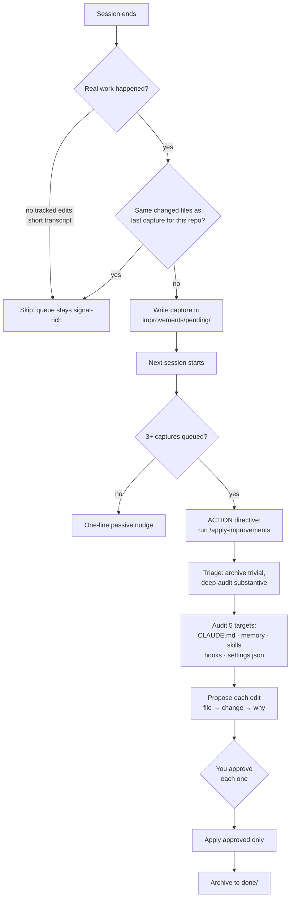

# claude-code-toolkit

Two plugins pulled straight out of my daily Claude Code config. They are not demos — both of
these run on every session I work in, which is the only real reason to trust them.

Both solve the same class of problem from opposite ends: **Claude agrees with you too much, and
forgets what it learned when the session ends.**

- **[challenger](#challenger)** makes it push back while you're working.
- **[apply-improvements](#apply-improvements)** makes what it learned survive the session.

## Install

```
/plugin marketplace add aiutomation/claude-code-toolkit
/plugin install challenger@claude-code-toolkit
/plugin install apply-improvements@claude-code-toolkit
```

Requirements: **Node** on PATH (challenger), **Python 3** on PATH (apply-improvements), git for
the capture hook's repo signals. Each hook checks for its runtime and exits quietly if missing,
so a partial setup degrades instead of erroring at you.

---

## challenger

A skeptical staff-engineer mode. It challenges what you propose *and* what the codebase already
does — but only when there's something real to challenge. Silence when the code is fine is the
whole discipline; a challenger that objects to everything gets ignored exactly when it matters.

### Turning it on

```
/challenger              # full (default)
/challenger lite         # only severe, high-confidence issues
/challenger ultra        # also architecture, whole-module rewrites, proactive
/challenger off          # or just say "stop challenger" / "normal mode"
```

It's **opt-in and sticky**: off until you turn it on, then it persists across `/clear`, `/compact`,
and full restarts until you turn it off. The level lives in a flag file (`~/.claude/.challenger-active`)
and a `SessionStart` hook re-injects the persona from it every time.

Worth knowing: the level switch is parsed by a `UserPromptSubmit` hook, not by the skill. So typing
`/challenger lite` works as plain prompt text and takes effect **that same turn** — you don't wait
for a skill invocation. (The skill itself is namespaced as `/challenger:challenger` if you want to
read it, per Claude Code's plugin-skill naming.)

### The ladder

Every decision and every piece of code gets run down six rungs. First one that fires is the
objection; if none fire, it stays quiet and does the work.

1. **Correctness / safety** — logic bug, race, unhandled failure, data-loss or security path. Fires at *every* level, including lite. Never dropped to be agreeable.
2. **Reinvented stdlib** — hand-rolled what the language or a standard library already does correctly.
3. **Inefficient where a standard fix exists** — O(n²) where a hash gives O(n), an N+1 query.
4. **Spaghetti / dead / duplicate code** — tangled flow, unreachable branches, copy-paste.
5. **Non-idiomatic** — fights the grain of the language or framework.
6. **Premature complexity** — abstraction or config serving a need that doesn't exist yet.

Every challenge has to carry four things or it doesn't ship: the specific smell with `file:line`,
the concrete consequence (not a vibe), a **better alternative**, and a calibrated confidence. No
alternative ready? Then it's a question, and it gets asked as one.

### What the levels actually change

Same prompt, three levels — *"I wrote a custom retry loop with `time.sleep` backoff for these API calls."*

| Level | Response |
|---|---|
| **lite** | Silent, unless the loop has a real correctness bug (e.g. it retries a non-idempotent POST). |
| **full** | `Challenge: hand-rolled retry @ client.py:40 → no jitter, no cap, easy to get the backoff math subtly wrong → better: tenacity's @retry or urllib3.Retry on the adapter (conf: high).` |
| **ultra** | "Drop the loop entirely. Retry belongs in the HTTP layer, not per-call site — mount a `Retry`-configured adapter once and every call inherits it. The custom loop is the seed of N inconsistent retry policies across the codebase (conf: high)." |

### Where it stays quiet

Code that's correct and clear. Constraints you already stated. Pure taste with no standards basis.
Decisions settled earlier in the session. Anything you explicitly locked. And once it has raised an
objection and you overrule it, it builds your version cleanly and doesn't re-argue — it raised it
once, that was the job.

Credit: the hook architecture is a remix of [ponytail](https://github.com/DietrichGebert/ponytail)
by Dietrich Gebert. See [NOTICE.md](plugins/challenger/NOTICE.md).

---

## apply-improvements

Claude Code learns things about your workflow every session — a rule that was missing from your
`CLAUDE.md`, a mistake worth converting into a guardrail hook, a repeated flow that should be a
skill. Then the session ends and all of it evaporates.

This closes that loop, and the design constraint is the interesting part: **a hook can't think.**
A `SessionEnd` hook runs a shell script, not a model, so it can't "audit the session and edit my
config intelligently." So the work is split — the hook does zero judgement and just preserves the
raw material; all the thinking happens later, interactively, where you approve each edit.



### The two gates that keep the queue usable

The first version of this flooded — every five-second session got captured. Two gates fixed it,
and both were learned the hard way:

**Meaningfulness.** Keying on `git status` doesn't work: in a repo with untracked logs or build
artifacts, status is *always* non-empty, so nothing ever got skipped. Real work shows up as
**tracked** changes (`git diff` / `--cached`) or as a substantial transcript. So: tracked edits
present → capture unless the session was a blink (<25KB transcript). No tracked changes → it was
planning or Q&A, keep it only if the discussion was genuinely long (≥200KB).

**Dedupe.** A permanently-dirty repo — uncommitted edits that never land — looks like fresh work
every single session. Deduping on the **set of changed file paths** plus recent commits collapses
that. Note it's the path *set*, not `diff --stat` text: the insertion counts drift every session
(149 → 143 → 112 insertions while the same files stay changed), so a text match never fired.

### Reviewing

Run it yourself any time:

```
/apply-improvements
```

Or let the `SessionStart` hook nudge you. Below 3 queued captures it prints a quiet one-liner;
at 3+ on a fresh start it injects an actionable directive so the session opens by draining the
queue. It deliberately won't do this on `compact` (that fires mid-session — hijacking your active
work would be worse than the backlog).

The skill then triages: captures with no real signal get batch-archived and listed so you see what
was dismissed; the substantive ones get the transcript read and a five-target audit. Every proposed
edit is presented as `file → change → why` through a multi-select, and **nothing is written without
your approval for that specific edit**. Processed captures move to `improvements/done/` so the
reminder stops flagging them.

Captures live in `~/.claude/improvements/pending/` as plain markdown — git signals, a transcript
pointer, and a digest of your own turns (embedded at capture time, because the transcript `.jsonl`
often gets rotated to a new filename on resume and the pointer dangles).

---

## Notes

Both plugins are MIT licensed. Both are single-purpose and composable — challenger governs what
gets flagged, not prose tone, so it stacks with whatever output style you already run.

If you find a case where challenger fires on something it shouldn't, that's the interesting bug.
Open an issue with the code it complained about.
