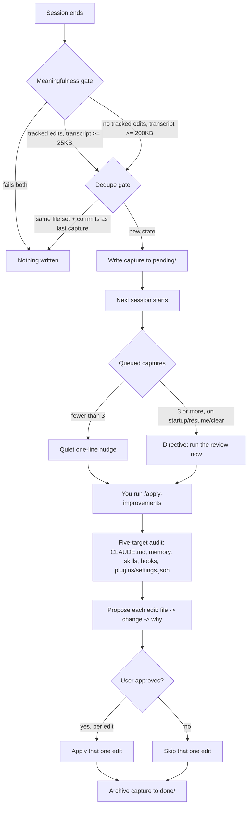

# Apply Improvements

Claude Code notices things about how you work, almost every session. A rule that should have gone into `CLAUDE.md` but never did. A mistake that keeps recurring and deserves a guardrail hook instead of another verbal reminder. A multi-step flow you repeat often enough that it should just be a skill. Then the session ends, and all of that noticing disappears with it.

This plugin exists to stop the disappearing. It captures the raw material of a session the moment it ends, then hands you a later, interactive review where you decide what actually becomes a permanent config change. It never edits anything on its own.

## Why the design is split in two

A `SessionEnd` hook runs a shell script, not a model. It can observe that a session just finished, but it has no way to read a transcript and judge whether something in it deserves to become a rule in `CLAUDE.md`. So the work is split across two different moments, run by two different things.

At session end, the hook does zero judgment. It writes down what happened: which files changed, what the recent commits were, a pointer to the transcript, and a short digest of what the user actually said. No interpretation, no decisions.

Later, when you run the review skill, all the thinking happens: reading the transcript, deciding what's durable versus one-off noise, drafting the actual edit, and waiting for you to approve it before touching any file. One phase collects, the other phase decides.

## What gets captured

Each capture is a markdown file written to `~/.claude/improvements/pending/`, named with a timestamp and the session ID. Inside:

- `git status --short`, `git diff --stat`, and `git log --oneline -5` for the session's working directory
- a pointer to the session's transcript path
- a digest pulled from the transcript at capture time: the first user turn (what the session set out to do) plus the last ten, deduplicated
- an audit checklist covering the five things the review skill will check

The digest matters for a specific reason: Claude Code often rotates a session's transcript `.jsonl` file to a new name when you resume it, which leaves the stored `transcript:` pointer in the capture dangling. If the review happens after that rotation, there's nothing left at that path to read. Embedding a digest of the user's own turns at capture time, while the file still exists, means the capture stays useful even after the original transcript is gone.

## The meaningfulness gate

Not every session is worth reviewing. A five-second session that only touched an untracked log file shouldn't join the queue next to a session where you fixed three bugs and corrected the assistant twice. The gate splits on whether any *tracked* file changed:

| Condition | Threshold to capture |
|---|---|
| Tracked edits present (`git diff --stat` or `git diff --cached --stat` non-empty) | capture unless the transcript is under 25,000 bytes |
| No tracked changes at all | capture only if the transcript is at least 200,000 bytes |

The gate deliberately does not key on plain `git status --short`. In a repo with untracked logs, `.db` files, or build artifacts that never get committed, `git status` is non-empty on essentially every run, so a gate built on it never actually skips anything. Every five-second session got captured, which is exactly the flood this gate exists to prevent. Keying on tracked changes, plus a size floor for the no-diff case (a long planning or Q&A conversation with no file changes still counts as real work), is what actually filters signal from noise.

## The dedupe gate

A repo that stays permanently dirty (edits sitting uncommitted for days) would otherwise pass the meaningfulness gate every single session and flood the queue with near-identical captures. Before writing a new one, the hook checks the newest existing capture for the same working directory: if it recorded the same *set* of changed file paths and the same recent commits, the new capture is skipped.

The comparison is on the set of changed paths, not the `diff --stat` text. Insertion and deletion counts drift between runs even when nothing meaningful changed, the source comments cite the same files reporting 149, then 143, then 112 insertions across three sessions, so an exact text comparison would never have matched and the flood would never have collapsed. Comparing which files changed, rather than by how much, is what makes the dedupe actually fire.

There's also a quieter escape hatch: any headless `claude -p` run with `TWIN_CAPTURE_RUNNING` set in its environment is skipped outright, so background automation doesn't pollute the queue you're meant to review by hand.

## The SessionStart reminder

A queue nobody drains is just clutter, so the companion `SessionStart` hook checks how many captures are pending and reacts differently depending on the count and how the session started.

Below three pending captures, it prints a single quiet line naming the count and the latest file, and nothing more happens. At three or more, but only when the session is starting fresh (`source` is `startup`, `resume`, or `clear`), it injects a directive telling the session to open by running `/apply-improvements` before anything else, with an explicit carve-out to defer if the user's first message is clearly urgent. It never does this on `compact`: a compaction event happens in the middle of an existing task, and hijacking that moment to run an audit would be a worse interruption than just letting the backlog wait one more session.

## The full loop



## Running the review

`/apply-improvements` (namespaced as `/apply-improvements:apply-improvements` since it ships as a plugin skill) is where the actual judgment happens.

With a backlog of several captures, it does a fast first pass over the cheap git signals alone: trivial sessions (no tracked changes, tiny scope, or a session already learned from) get batch-archived straight to `done/` with just a list so you can see what was dismissed, no proposals wasted on noise. Substantive sessions, real commits, repeated friction, corrections you had to make, get the deeper treatment: the transcript gets read (falling back to git signals plus the embedded digest, and saying so explicitly, if the transcript has rotated away).

For each substantive capture, the skill audits five surfaces:

- **CLAUDE.md**, global or project-level, for a rule that was missing, wrong, or too vague
- **Memory files**, for a fact or piece of feedback worth persisting with a proper index entry
- **Skills**, for a repeated flow worth turning into one, or an existing skill whose trigger misfired
- **Hooks**, for a recurring mistake worth turning into a deterministic guardrail
- **Plugins and settings.json**, for anything stale, noisy, or missing

Every candidate is presented as `file -> change -> why` through a multi-select prompt. Nothing is written without approval for that specific edit, and one approval means exactly one edit, never a batch applied on the strength of one yes. Once a capture's edits are handled (applied or explicitly skipped), the file moves from `pending/` to `~/.claude/improvements/done/` so it stops showing up in the reminder count.

## Requirements

Just `python3` on your PATH (both hooks check for it and exit quietly if it's missing, with a PowerShell fallback path on Windows) and `git` for the repo signals. No API key, no network call, no npm package to install.

## Install

```
/plugin marketplace add aiutomation/claude-code-toolkit
/plugin install apply-improvements@claude-code-toolkit
```

Then run `/apply-improvements` whenever you want to drain the queue, or just wait for the reminder to tell you it's time.

## Limitations, stated plainly

This plugin only ever proposes. If you never run `/apply-improvements`, the queue just grows and nothing changes in your config. If a transcript has rotated away by the time you review a capture, the audit falls back to git signals and the embedded digest, and it says so rather than pretending it read the full session. And the gates are heuristics built on file changes and transcript size: a genuinely important short session with no tracked edits can still get skipped. None of this replaces actually reading your own sessions occasionally.

## How this differs from the alternatives

Anthropic's own `claude-md-management` plugin audits `CLAUDE.md` quality directly and ships a `/revise-claude-md` command that folds session learnings into `CLAUDE.md` or `.claude.local.md`. It's a good tool for keeping one file in shape. This plugin's scope is wider but shallower per file: it audits five separate surfaces, including hooks and `settings.json`, not just the one memory file.

Other memory plugins, `claude-mem`, SuperBrain, Recall, solve a different problem: they persist session context and re-inject it so a future session remembers what happened before. That's valuable if what you want is continuity of context. This plugin doesn't try to remember your context at all; it tries to change your configuration based on what a session revealed. If you want Claude to recall what you discussed last week, use a memory plugin. If you want the mistakes and missing rules from that session to turn into an actual edit to `CLAUDE.md` or a new hook, that's what this one is for.

---

Part of the `claude-code-toolkit` marketplace, alongside other independent plugins covering different parts of the Claude Code workflow.
