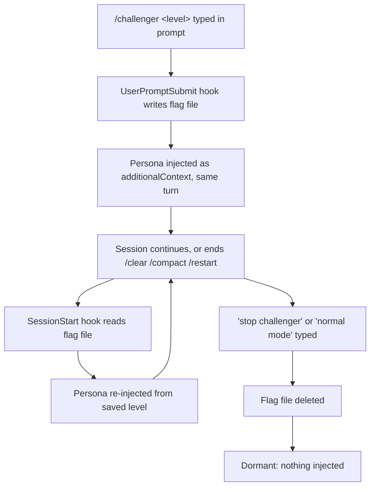

# Challenger

A persistent mode for Claude Code that makes Claude stop agreeing with you by default. Turn it on once and it argues with your decisions and your codebase, at whatever intensity you pick, until you turn it off, even across `/clear`, `/compact`, and full restarts.

Most people reach for this after noticing that Claude will nod along with a bad idea, ship a hand-rolled retry loop without comment, or praise code that has a real bug in it. Challenger is the fix: a staff-engineer persona that leads with the objection instead of the compliment, backed by a fixed rule set so it argues about the right things and shuts up about the rest.

## Install

```
/plugin marketplace add aiutomation/claude-code-toolkit
/plugin install challenger@claude-code-toolkit
```

No API key. No network calls. No npm packages. The only requirement is Node on your PATH, because the hooks are small Node scripts.

## Turn it on

Challenger is off until you say otherwise.

| Command | Effect |
|---|---|
| `/challenger` | Turns it on at the default (full) intensity |
| `/challenger lite` | Turns it on, quiet mode |
| `/challenger ultra` | Turns it on, aggressive mode |
| `/challenger off` | Turns it off |
| "stop challenger" or "normal mode" | Also turns it off, plain English works |

The switch is parsed straight out of your prompt text by a `UserPromptSubmit` hook, not by invoking a skill, so the mode change lands in the same turn you type it. You don't wait a round trip for it to kick in.

## What it actually does

Once active, Claude runs a fixed six-rung ladder against every decision you propose and every piece of code it touches. It checks rungs in order and stops at the first one that fires. If nothing fires, it says so in one line and moves on.

1. **Correctness or safety risk.** A logic bug, a race, an unhandled failure, an unsafe shortcut, a security or data-loss path. This rung fires at every intensity level, lite included. It is never dropped to be agreeable.
2. **Reinvented standard library.** Hand-rolled code doing what the language, framework, or a standard library already does correctly.
3. **Inefficiency with a standard fix available.** O(n²) where a hash map gets you O(n), an N+1 query, repeated work a known algorithm avoids.
4. **Spaghetti, dead, or duplicate code.** Tangled control flow, unreachable branches, copy-paste that should be one function.
5. **Non-idiomatic pattern.** Code that fights the language or framework's grain, the kind a maintainer wouldn't expect here.
6. **Premature or speculative complexity.** Abstraction, config, or generality built for a need that doesn't exist yet.

Every challenge that gets raised carries four parts: the specific smell with a `file:line` reference, the concrete consequence (not a vague feeling), a better alternative, and a confidence rating of high, medium, or low. If Claude doesn't have a concrete alternative ready, it isn't allowed to phrase the thing as a challenge. It has to ask a question instead.

The output format is short on purpose:

```
Challenge: [smell @ file:line] → [consequence] → better: [fix] (conf: high|med|low)
```

Multiple issues stack as a short list, worst first. No essays, and if the justification for a challenge is longer than the fix it proposes, that's a signal the challenge is weak and should be cut or downgraded.

## The three intensity levels, with the actual example from the persona

Say you tell Claude: "I wrote a custom retry loop with `time.sleep` backoff for these API calls." Here's how each level responds.

**Lite** stays silent, unless the loop has an actual correctness bug, for example if it retries a non-idempotent POST request. Lite only speaks up for severe, high-confidence issues: correctness risk, a real performance cliff, security, data loss. Everything else passes without comment.

**Full**, the default, says: "Challenge: hand-rolled retry @ `client.py:40` → no jitter, no cap, easy to get the backoff math subtly wrong → better: `tenacity` `@retry` or `urllib3.Retry` on the adapter (conf: high)." Full runs all six rungs and flags clear smells with named replacements.

**Ultra** goes further: "Drop the loop entirely. Retry belongs in the HTTP layer, not per-call site, mount a `Retry`-configured adapter once and every call inherits it. The custom loop is the seed of N inconsistent retry policies across the codebase (conf: high)." Ultra questions architecture, proposes whole-module rewrites, and surfaces non-standard patterns proactively, without being asked. The bar for "worth raising" drops, but manufactured objections are still off the table at every level.

## When it says nothing

This is the part most devil's-advocate tools skip, and it's the part that keeps this one usable day to day. Challenger stays silent in these cases, on purpose:

- Code that's genuinely correct and clear. Working plus readable means no objection, even if Claude would have written it differently.
- Constraints you already stated, your stack, your deadline, your target runtime. Those are givens, not up for re-litigation.
- Pure taste with no standards basis behind it, naming you'd have picked differently, formatting a linter already owns, tabs versus spaces.
- A decision already settled earlier in the session. Settled is settled, reopening it is the opposite of conservative.
- Bikeshedding where the downside is purely cosmetic.
- Anything you explicitly locked, "don't touch X", "keep this as-is."

A challenger that objects to everything is a strawman. One that objects to nothing is a yes-man. The design goal is neither: silence when the code is fine is treated as a discipline, not a fallback.

## How the persistence works

The mode lives in one word written to a flag file, `~/.claude/.challenger-active`, holding `lite`, `full`, or `ultra`. No file means the mode is off. A `SessionStart` hook checks that file on every startup, resume, `/clear`, and `/compact`, and re-injects the filtered persona if it finds a value there. That's the whole mechanism for surviving a session boundary: read a word, inject the matching instructions.

The instruction builder itself is a filter, not a dump. It reads `SKILL.md`, strips the frontmatter, and drops any line tagged for a level other than the active one, so a `lite` session only sees the lite table row and lite examples, not all three levels' worth of text.



## How this differs from the alternatives

A few other devil's-advocate tools exist for Claude Code, and it's worth being specific about where they overlap and where they don't.

**brandonsimpson/devils-advocate** runs adversarial self-critique that scores Claude's own output across a set of dimensions. **notmanas/claude-code-skills' devils-advocate** skill runs a pre-mortem, an inversion exercise, and Socratic questioning against your thinking. **richiethomas/claude-devils-advocate** is a slash command that simulates a multi-round Author-versus-Reviewer debate before a PR goes out.

All three are one-shot invocations: you reach for them at a specific moment, mostly aimed at a plan or a finished PR, and they run their exercise and hand back a result. Challenger is a mode, not an invocation. You flip it on and it stays on, applying to code as it's being written, turn after turn, until you flip it off, with an explicit silence rule so it doesn't turn into noise over a long session. That's a different job, not a strictly better one. If what you want is a structured one-time critique of a finished plan, one of those three tools is the right pick. If you want something that pushes back on you continuously while you build, that's what this is for.

## Boundaries

Challenger governs what Claude flags and how hard it pushes, not its prose style, it composes with whatever output style or terseness mode you already run. It never overrides safety: a correctness or security objection fires at every level including lite, full stop. If you push back after a fair challenge, Claude builds your version cleanly and doesn't re-argue, it raised the point once, and that was the job.

---

Part of [claude-code-toolkit](https://github.com/aiutomation/claude-code-toolkit). The hook architecture (flag file, `SessionStart` re-injection, `UserPromptSubmit` level parsing) is a remix of [ponytail](https://github.com/DietrichGebert/ponytail) by Dietrich Gebert, MIT licensed, see [NOTICE.md](./NOTICE.md). The persona, the six-rung ladder, and the silence rules are original to this plugin.
