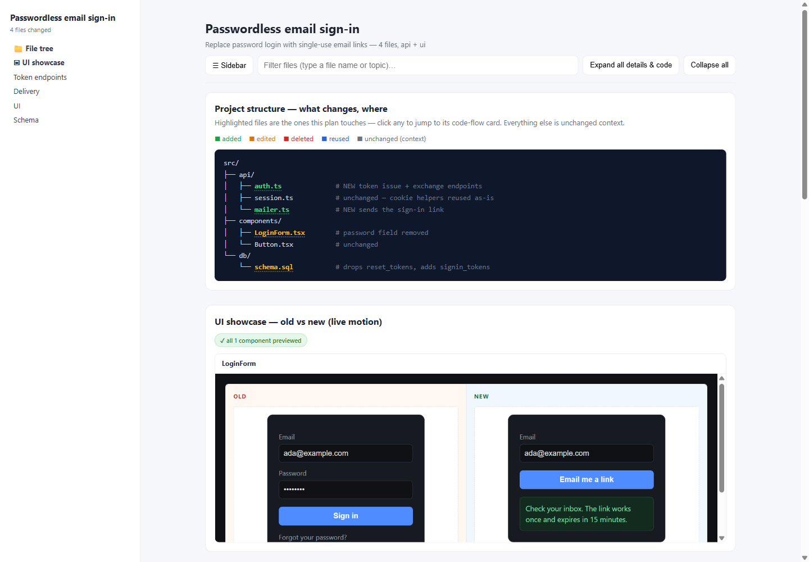
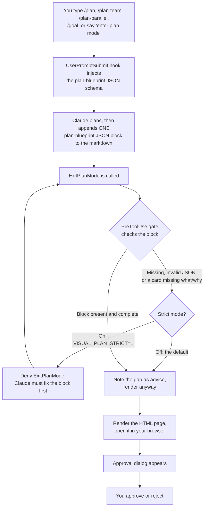
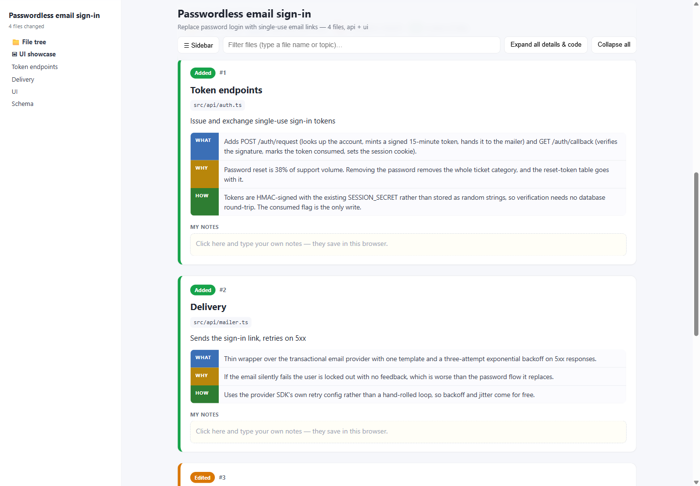

# visual-plan

Claude Code's plan mode normally gives you a wall of markdown to skim, then a yes/no approval dialog. This plugin puts a rendered, interactive HTML page in your browser between those two steps: a file tree with the changed files colour-coded and clickable, one explanation card per file with what/why/how panels and a notes box, an optional flowchart for control flow, and an optional side-by-side preview of old versus new UI components. It happens before you click approve, not after.


*A real render: the sidebar and file tree on the left, the old-vs-new UI showcase on the right, from a "passwordless email sign-in" plan.*

## Why this exists

Plan mode is where Claude Code asks you to trust it with a set of file changes before it makes them. Reading several paragraphs of prose to judge which files touch auth, or whether this replaces your password field, is slow, and it's easy to approve on a skim. Instead of reviewing the plan by reading prose top to bottom, you get a page: files you can click, a card per file that states what changed and why, and, if the plan touches UI, a rendered comparison of the old and new component.

## What renders on the page

- **File tree:** an ASCII tree Claude writes as part of the plan, with lines matching a changed file auto-highlighted and colour-coded (green add, amber edit, red delete, blue reuse). Click a highlighted line and it jumps to that file's card.
- **Per-file cards:** one card per changed file, with a WHAT / WHY / HOW table (what changed in this file, why, how it works) plus a "my notes" text box under each card. Notes autosave in the browser via localStorage, so they survive a page refresh but never leave your machine.
- **Flowchart (optional):** Claude can add step and edge data for a file with real internal control flow, a branch, a loop, a multi-step pipeline, and it renders as a Mermaid diagram. Plain edits skip this; not every changed file needs one.
- **UI showcase (optional):** for UI changes, Claude authors an old and a new HTML/CSS fragment per component, and the page renders both in sandboxed iframes side by side, with a replay button for anything animated.

## How it wires into plan mode

Three hooks make this happen, and none of them wait on you to ask for a diagram.



1. **UserPromptSubmit** watches for `/plan`, `/plan-team`, `/plan-parallel`, `/goal`, and phrases like "enter plan mode." When it matches, it injects the full JSON schema for the `plan-blueprint` block into context, so Claude knows the field names before it starts writing.
2. **PreToolUse on `ExitPlanMode`/`EnterPlanMode`** does the actual work. It runs synchronously, inside a 20-second timeout, before the approval dialog can appear. This is the hook that makes the render happen in time to matter: it extracts the ```plan-blueprint``` block, checks it, and calls the renderer.
3. **PostToolUse** fires after you approve and leaves instructions for re-rendering later, in case the plan changes mid-execution.

## The gate, and strict mode

The PreToolUse hook checks three things before it renders: is there a `plan-blueprint` block at all, does it parse as JSON, and does every card carry both a `what` and a `why`. By default, strict mode is off, and failing any of these three checks is reported as advice attached to the render. The page still opens with whatever is there. A missing block shows a diagnostic warning box instead of a card, rather than blocking you.

Set `VISUAL_PLAN_STRICT=1`, or write `{"strict": true}` to `~/.config/visual-plan/config.json` (`%APPDATA%\visual-plan\config.json` on Windows), and those same three checks deny `ExitPlanMode` instead. You can't approve the plan until Claude fixes the block. Turn it on if you want every plan to render the same way, with cards filled in every time instead of occasionally showing a warning box. It isn't the default because denying plan approval is a real behaviour change, and that shouldn't happen without you choosing it.


*Two of the four cards from the same render, each one a WHAT/WHY/HOW table plus a notes box that saves in the browser.*

## Where the files go

Inside a git repository, the render writes to `<git-root>/.plan-blueprints/latest.html` and adds itself to `.gitignore` automatically, so it never shows up as a dirty file. A second copy, timestamped, plus `current-blueprint.html`, lands under `~/.claude/plan-mermaid/`. Set `VISUAL_PLAN_DIR` to move that global copy somewhere else. Outside a git repo, only the global copy gets written.

## Requirements

| Requirement | Needed for |
|---|---|
| Node on PATH | Everything. The hooks and the renderer are Node scripts. |
| python3 | Only the bundled `script-to-diagram` skill (below). Plan rendering itself works without it. |
| git | Optional. Enables the in-repo `.plan-blueprints/` copy. |

Nothing else. No `npm install`, no API key, no network call at render time. Mermaid and Prism ship vendored inside `assets/` (MIT-licensed, see `assets/VENDOR-LICENSES.md`) instead of loading from a CDN. An earlier version of this plugin shelled out to the `mmdc` CLI for diagram rendering, which broke silently in June 2026. Vendoring the JS libraries removed that failure mode entirely, since there's no external process left to go missing.

## Install

```
/plugin marketplace add aiutomation/claude-code-toolkit
/plugin install visual-plan@claude-code-toolkit
```

## A gotcha worth knowing about

In the `components[]` array, each entry's `name` field has to be the component's file basename without an extension: `LoginForm`, not `src/components/LoginForm.tsx` and not `LoginForm.tsx`. The completeness check that flags a "changed component not previewed" derives the expected names from the basenames of changed `.tsx`/`.jsx`/`.vue`/`.svelte` files, so a mismatched name means the component you actually authored never gets matched. You end up with two slots for one component: one filled in, one sitting there as an empty warning. I hit this putting the demo screenshots together.

## What this doesn't do

The UI showcase is HTML and CSS written by Claude to approximate the component, not a render of your actual source. Nothing here takes a screenshot, runs a headless browser, or diffs the preview against the real component code. The "not previewed" warning only guarantees a changed frontend file is accounted for in the JSON, not that the preview on screen matches what will ship. Read the plan text and the code block inside each card if you want the real diff. Treat the showcase panel as an illustration Claude drew for you, not a source of truth.

## The second entry point: script-to-diagram

Bundled alongside the plan hooks is a `script-to-diagram` skill, invoked directly rather than through plan mode: point it at any script or notebook and it builds a similar self-contained HTML map, one flowchart per file plus a cross-file overview. It's a Python (standard library only) implementation of the same card format. The JS renderer's Mermaid-building and card-rendering functions are actually ports of this skill's Python functions. It needs `python3` to run, but plan rendering itself never touches Python. Reach for it when you want a diagram of code that isn't part of a plan you're about to approve.

## How this differs from the alternatives

[claude-mermaid](https://github.com/veelenga/claude-mermaid) is an MCP server for live-reload Mermaid previews: you ask for a diagram, it renders and updates as you iterate. Various C4 and architecture-diagram skills do something similar, producing a diagram on request. All of them answer the same question: can you draw me a diagram of this. This plugin answers a different one: can I see the plan you're about to make me approve. It's wired into the `ExitPlanMode` approval gate itself, so the render happens automatically, every time, without you asking for it. The diagram is only one panel on that page; the point of the page is that it appears before the decision, not after it.

---

Part of the [claude-code-toolkit](https://github.com/aiutomation/claude-code-toolkit) marketplace.
